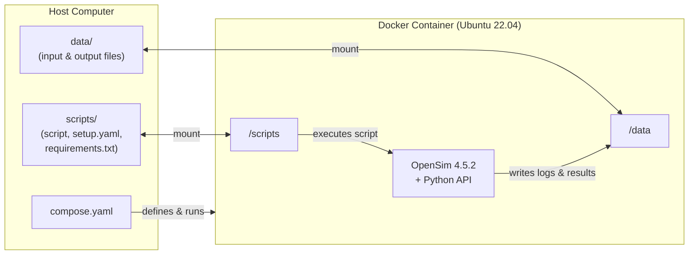

# OpenSim Portable

This repository provides instructions and resources to use the OpenSim Portable Docker image. The author has no affiliation with the OpenSim team, the main goal of this image and repo is to facilitate OpenSim Python scripting and automation for biomechanics researchers.

## Why?

OpenSim is one of the most common simulation and computation tools in biomechanical research. However, the setup process, especially when building from source, is rigorous and complex. The idea of implementing this version came to me after witnessing numerous troubles students were having with OpenSim scripting. The key point was to provide a light-weight, out-of-the-box environment not needing any installation and free from dependency conflicts.

## How does it work?

Docker is an application that allows to handle isolated environments (**containers**) defined by **images**. The Docker image associated with this repo contains a built OpenSim 4.5.2 environment (based on Ubuntu 22.04) with the Python API set up.

The container is run with mounted volumes from the host computer: the *data* volume containing the input and output data, and the *scripts* volume containing the script to be executed, a setup file, and a requirements file.

The Docker Compose (*compose.yaml*) file defines how the container should be run: from what image and with what volumes.

When running, the container executes the script in the *scripts* volume, indicated by the user, writing the logs to the *data* volume. The logs allow the user to debug the code without going inside the container.



## How is this repo structured?
* data - an example data volume
    * tutorial_3 - example data for tutorial 3 (scaling, inverse kinematics, inverse dynamics)
    * tutorial_4 - example data for tutorial 4 (IMU-based inverse kinematics)
    * Geometry - geometry files shared across tutorials
* scripts - an example scripts volume
    * requirements.txt - a requirements file for pip, used to install needed Python libraries.
    * setup.yaml - a file to set up the active script and requirements file.
    * tutorial_3.py - an example script following the [official OpenSim tutorial 3](https://opensimconfluence.atlassian.net/wiki/spaces/OpenSim/pages/53089741/Tutorial+3+-+Scaling+Inverse+Kinematics+and+Inverse+Dynamics#IV.-Inverse-Kinematics)
    * tutorial_4.py - an example script following the [official OpenSim tutorial 4](https://opensimconfluence.atlassian.net/wiki/spaces/OpenSim/pages/53084203/OpenSense+-+Kinematics+with+IMU+Data)

* compose.yaml - setting up the image to be used and the volumes to be mounted

## Getting started

1. [Download and install Docker](https://www.docker.com/get-started/) on your system.
2. Clone this repository.
3. Using console, navigate to the repo folder and run ```docker compose up```. Docker should run the container and process the example data, writing the outputs and the logs to *data* folder. Upon processing the data, the container should exit on its own, but you can use ```docker compose down``` to take it down forcefully.

## Usage considerations

* The processing results can be easily visualized with OpenSim GUI.
* In theory, the user's scripting capability is unlimited as long as it doesn't need any additional software modules (except for Python libraries that can be installed by listing them in *requirements.txt*).
* An important feature of this implementation is a possibility for automated processing of large amounts of data. For that, one could mount the whole dataset folder as *data* and iterate through it using the active script.
* Pay attention to the paths and file names. The environment inside the container is Linux (Ubuntu 22.04). *data* and *scripts* volumes land at the root, at */data* and */scripts* respectively. Relative paths in scripts and setup files can lead to ambiguity or unpredictable behaviour, so it is recommended to specify all paths as absolute (e.g. ```/data/tutorial_3/gait2354_simbody.osim``` instead of ```gait2354_simbody.osim```). Note that some OpenSim API fields expect bare file names and resolve them relative to a working directory, while others require full paths. There is no consistent rule — check the container logs for file access errors and adjust accordingly.
